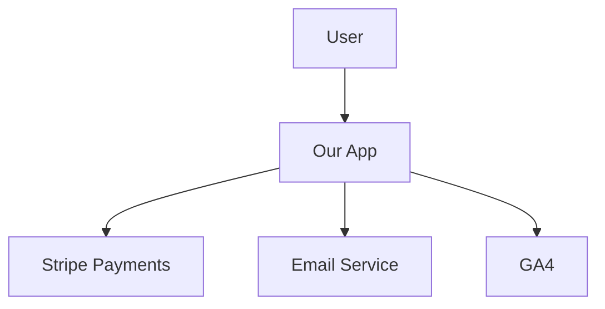
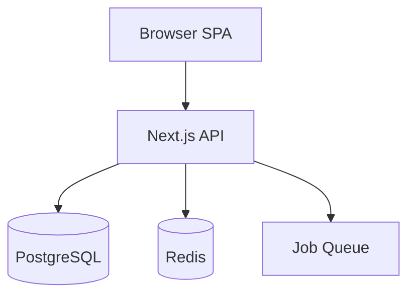

# BUILDER — Architecture Documentation

## Proposito
Documentar COMO o sistema funciona — nao so O QUE faz.

## Comandos
| Comando | Descricao |
|---------|-----------|
| `/builder-architecture-doc [app]` | Doc completa (C4 model) |
| `/builder-architecture-doc diagram [tipo]` | Diagrama especifico |
| `/builder-architecture-doc adr [decisao]` | Architecture Decision Record |

## C4 Model (4 niveis)

### Level 1: System Context


### Level 2: Container


### Level 3: Component (per container)
### Level 4: Code (per component)

## ADR Template (Architecture Decision Record)
```markdown
# ADR-001: Use PostgreSQL over MongoDB

## Status: Accepted
## Context: Need a database for...
## Decision: PostgreSQL because...
## Consequences: +relational queries, +ACID, -document flexibility
```

## Output
1. C4 diagrams (mermaid, all 4 levels)
2. Data flow diagram
3. API contracts summary
4. Security model (auth, encryption, access)
5. ADR log (key decisions documented)
