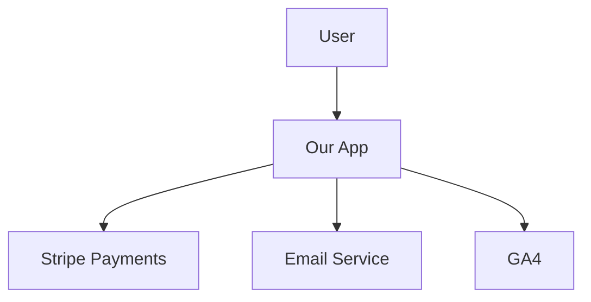
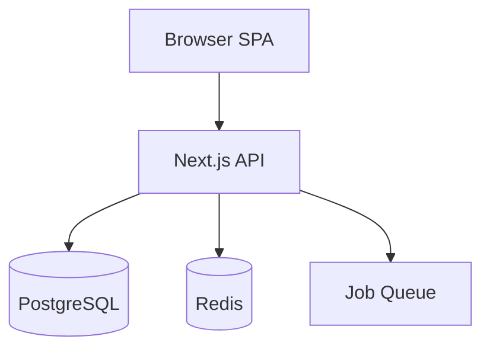
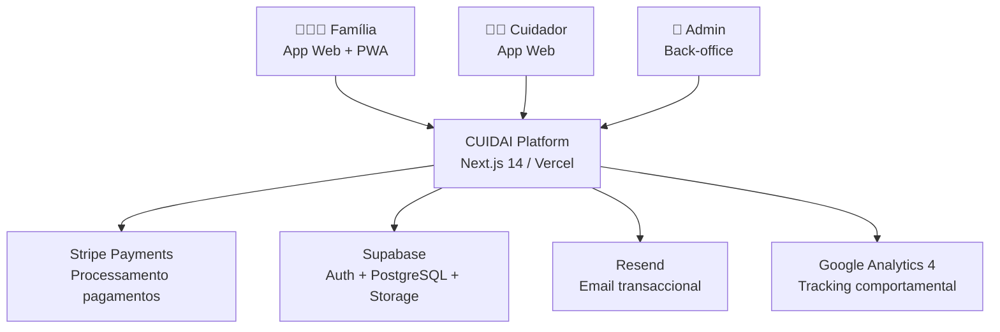
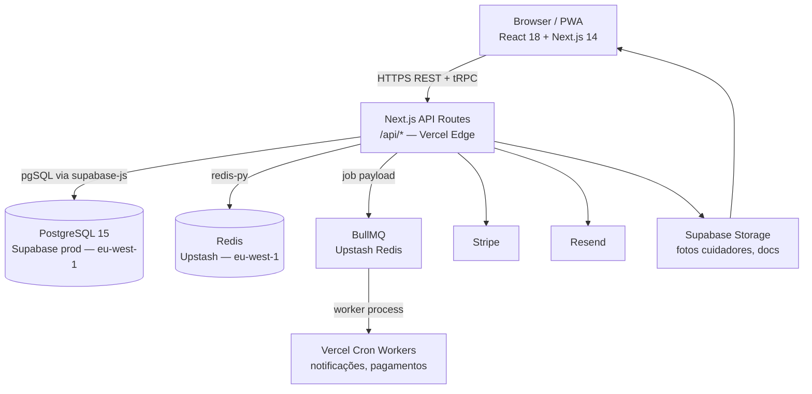
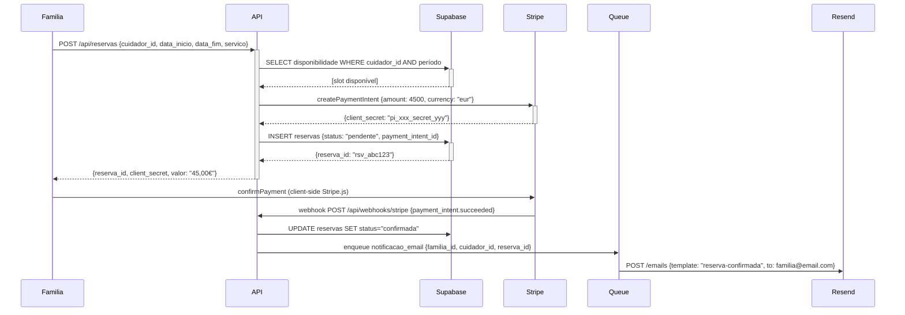

# BUILDER — Architecture Documentation

## Proposito
Documentar COMO o sistema funciona — nao so O QUE faz.

## Comandos
| Comando | Descricao |
|---------|-----------|
| `/builder-architecture-doc [app]` | Doc completa (C4 model) |
| `/builder-architecture-doc diagram [tipo]` | Diagrama especifico |
| `/builder-architecture-doc adr [decisao]` | Architecture Decision Record |

## C4 Model (4 niveis)

### Level 1: System Context


### Level 2: Container


### Level 3: Component (per container)
### Level 4: Code (per component)

## ADR Template (Architecture Decision Record)
```markdown
# ADR-001: Use PostgreSQL over MongoDB

## Status: Accepted
## Context: Need a database for...
## Decision: PostgreSQL because...
## Consequences: +relational queries, +ACID, -document flexibility
```

## Output
1. C4 diagrams (mermaid, all 4 levels)
2. Data flow diagram
3. API contracts summary
4. Security model (auth, encryption, access)
5. ADR log (key decisions documented)

## Delivery-ready self-check (run BEFORE delivering to client)

Output é **delivery-ready (90+/100)** se TODAS estas check passam.

### Gate 1 — C4 Model completo (todos os 4 níveis presentes)
- [ ] Level 1 (System Context) mostra o sistema + todos os actores externos relevantes (humanos, sistemas externos)
- [ ] Level 2 (Container) detalha cada processo/store/app separado com tecnologia nomeada (ex: "Next.js 14 API", "PostgreSQL 15")
- [ ] Level 3 (Component) existe para pelo menos o container principal, com responsabilidades por componente
- [ ] Level 4 (Code) presente ou justificado por escrito se omitido (ex: "omitido — componentes simples sem lógica complexa")
- [ ] Todos os diagramas renderizáveis em Mermaid (sintaxe válida, sem nós soltos)
- ❌ NOT delivery-ready: Diagrama genérico com `App[Our App] --> DB[(Database)]` sem tecnologias reais
- ✅ Delivery-ready: `API[Next.js 14 API Routes\n/api/*] --> DB[(PostgreSQL 15\nsupabase-prod)]`

### Gate 2 — Data Flow Diagram com dados reais e direcções explícitas
- [ ] Cada seta tem label com o quê circula (ex: `--JWT Bearer token-->`, `--"pedido_id, valor_eur"-->`)
- [ ] Distingue read vs write flows com notação diferente ou legenda
- [ ] Inclui flows assíncronos se existirem (webhooks, queues, cron jobs)
- [ ] Identifica onde dados pessoais/sensíveis transitam (RGPD-relevant paths marcados)
- ❌ NOT delivery-ready: `User --> API --> DB` sem labels, sem direcção de dados
- ✅ Delivery-ready: `Cuidai_App --"POST /auth {email, bcrypt_hash}"--> Supabase_Auth --"JWT 24h"--> Client`

### Gate 3 — API Contracts summary com exemplos reais
- [ ] Cada endpoint tem: método HTTP, path, request schema (campos + tipos), response schema, auth requirement
- [ ] Status codes documentados (200, 400, 401, 404, 422, 500) com quando ocorrem
- [ ] Rate limits e pagination documentados se aplicável
- [ ] Pelo menos um exemplo de request/response com dados reais do projecto (não `"foo": "bar"`)
- ❌ NOT delivery-ready: `POST /api/users — cria utilizador`
- ✅ Delivery-ready: `POST /api/cuidadores — cria perfil cuidador; body: {nome: string, nif: string(9), zona_id: uuid}; 201 {cuidador_id, created_at}; auth: Bearer (role=admin)`

### Gate 4 — Security Model explícito e completo
- [ ] Autenticação documentada: mecanismo (JWT/session/OAuth), provider, duração de tokens
- [ ] Autorização documentada: modelo (RBAC/ABAC), roles existentes, o que cada role pode fazer
- [ ] Encriptação: at rest (quê, onde) e in transit (TLS versão, certificados)
- [ ] Secrets management: como são geridos (ex: Vercel env vars, Doppler, AWS Secrets Manager)
- [ ] Threat model ou pelo menos lista de attack surfaces identificadas
- ❌ NOT delivery-ready: "O sistema usa autenticação segura e encriptação."
- ✅ Delivery-ready: "JWT (Supabase Auth, HS256, 24h access + 7d refresh). Roles: `admin`, `cuidador`, `familia`. PostgreSQL RLS activo por `user_id`. TLS 1.3 (Vercel Edge). Secrets em Vercel env (prod) + `.env.local` (dev, gitignored)."

### Gate 5 — ADR Log com decisões reais do projecto
- [ ] Mínimo 3 ADRs documentados para arquitecturas não-triviais
- [ ] Cada ADR tem: Status (Proposed/Accepted/Deprecated/Superseded), Context (o problema real), Decision (a escolha e porquê), Consequences (trade-offs honestos +/-)
- [ ] ADRs referem alternativas consideradas e rejeitadas com razão
- [ ] Data e autor do ADR presentes
- ❌ NOT delivery-ready: `ADR-001: Usar PostgreSQL. Motivo: é bom para dados relacionais.`
- ✅ Delivery-ready: `ADR-002: Supabase sobre Firebase | Aceite 2024-11-03 | Contexto: precisamos de auth + DB + RLS sem DevOps overhead | Decisão: Supabase por RLS nativa, PostgreSQL standard, pricing previsível | Consequências: +SQL portável, +RLS row-level, -vendor lock Supabase SDK, -cold starts em free tier`

### Gate 6 — Output usa CLIENT NAME + dados reais, zero placeholders angle-brackets
- [ ] Nenhum `<your-app>`, `<database>`, `<service-name>`, `<insert here>` presente no output final
- [ ] Nome do sistema/produto aparece nos diagramas e nos títulos (ex: "CUIDAI — Architecture Documentation")
- [ ] Tecnologias têm versões reais (se conhecidas) ou "versão a confirmar" explícito
- [ ] Nomes de environments reais: `prod`, `staging`, `dev` — não `environment1`
- ❌ NOT delivery-ready: `graph TB; User --> App[<app-name>] --> DB[(<database-name>)]`
- ✅ Delivery-ready: `graph TB; Familia[Família\nWeb + iOS] --> LDC[Lisbon Dog Care\nNext.js 14] --> DB[(PostgreSQL\nSupabase prod)]`

---

### 7. Status checklist per data point (Gate 7 — validated FASE 1)

Cada número/nome/facto no output de arquitectura deve ter label EXPLÍCITO:

- 🔵 **verified** — confirmado via codebase (Read/Grep), session anterior, ou cliente data
- 🟡 **assumed** — plausível dado o stack visível, mas precisa confirmação antes de entregar
- 🟢 **projection** — decisão de design futura ou componente ainda não implementado

Output checklist upfront mostra ao leitor exactamente o que é trust-as-is vs o que precisa de verificar. **Honest transparency > arquitectura que parece completa mas tem gaps.**

❌ NOT delivery-ready:
```
API[Next.js 14 API] --> DB[(PostgreSQL 15)]
JWT (HS256, 24h access + 7d refresh). RLS activo por user_id.
Rate limit: 100 req/min.
```
*(reader assume tudo verified — mas versões, RLS e rate limits podem ser assumptions não confirmadas)*

✅ Delivery-ready:
```
🔵 verified  — Next.js 14 (confirmado via package.json)
🔵 verified  — PostgreSQL em Supabase (confirmado via supabase/config.toml)
🟡 assumed   — JWT refresh token 7d (padrão Supabase — confirmar se customizado)
🟡 assumed   — Rate limit 100 req/min (não encontrado em codebase — confirmar infra)
🟢 projection — Redis cache layer (proposto no ADR-003, não implementado ainda)
```

**Ship checklist post-cliente-sync:**
- [ ] All 🟡 items confirmed — substituir assumptions com actuals (ex: token TTL real, rate limits configurados, versões exactas de infra)
- [ ] All 🔵 citations adicionadas — path do ficheiro ou sessão fonte por cada facto verificado (ex: `package.json:L4`, `supabase/config.toml:L12`)
- [ ] All 🟢 projections labeled explicitamente ao cliente — deixar claro o que é arquitectura futura vs estado actual do sistema

## Fully-worked A-tier example (delivery-ready reference)

```markdown
# CUIDAI — Architecture Documentation
**Versão:** 1.2 | **Data:** 2025-01-15 | **Autor:** DARIO

---

## Level 1: System Context



---

## Level 2: Container



---

## Level 3: Component — Next.js API Routes

```mermaid
graph TB
    Router[Next.js Router] --> AuthM[Auth Middleware\nvalidate JWT + role]
    AuthM --> CuidadoresC[/api/cuidadores\nCRUD perfis]
    AuthM --> ReservasC[/api/reservas\ngestão reservas]
    AuthM --> PagamentosC[/api/pagamentos\nStripe intents]
    AuthM --> AdminC[/api/admin\nback-office ops]
    CuidadoresC --> SupabaseClient[Supabase Client\nRLS enforced]
    ReservasC --> SupabaseClient
    ReservasC --> Queue
    PagamentosC --> Stripe
    PagamentosC --> SupabaseClient
```

---

## Level 4: Code — ReservasController

```
ReservasController
├── createReserva(dto: CreateReservaDto)
│   ├── validateDisponibilidade(cuidador_id, data_inicio, data_fim)
│   ├── calcularPreco(horas, tarifa_cuidador)
│   ├── createStripePaymentIntent(valor_eur, metadata)
│   └── insertReserva(reserva_record) → reserva_id
├── cancelReserva(reserva_id, motivo)
│   ├── checkCancellationPolicy(data_inicio) → penalty_pct
│   ├── processRefund(payment_intent_id, amount)
│   └── updateStatus('cancelada', cancelled_at)
└── listReservas(familia_id, filters) → Reserva[]
```

---

## Data Flow — Reserva Criada



---

## API Contracts Summary

### POST /api/reservas
**Auth:** Bearer JWT (role: `familia`)
```json
Request:  { "cuidador_id": "uuid", "data_inicio": "2025-02-10T09:00:00Z",
            "data_fim": "2025-02-10T13:00:00Z", "servico": "acompanhamento_idoso" }
Response 201: { "reserva_id": "rsv_abc123", "client_secret": "pi_xxx_secret_yyy",
                "valor_eur": 45.00, "status": "pendente" }
Response 409: { "error": "SLOT_UNAVAILABLE", "message": "Cuidador indisponível neste período" }
Response 422: { "error": "VALIDATION_ERROR", "fields": ["data_fim deve ser > data_inicio"] }
```

### GET /api/cuidadores?zona=lisboa&servico=idosos&disponivel=2025-02-10
**Auth:** Bearer JWT (any role)
**Pagination:** `?page=1&limit=20`
```json
Response 200: { "data": [{ "cuidador_id": "uuid", "nome": "Ana Silva",
                "tarifa_hora": 11.25, "rating": 4.8, "reviews": 34 }],
                "total": 127, "page": 1 }
```

---

## Security Model

| Layer | Mecanismo | Detalhe |
|-------|-----------|---------|
| Autenticação | Supabase Auth (JWT HS256) | Access token 24h, Refresh 7 dias, rotação automática |
| Autorização | PostgreSQL RLS + middleware role check | Roles: `familia`, `cuidador`, `admin` |
| Encriptação in transit | TLS 1.3 | Vercel Edge Certificates (auto-renovação) |
| Encriptação at rest | AES-256 | Supabase managed (AWS eu-west-1) |
| Secrets | Vercel Environment Variables | prod/preview/dev isolados; nunca em código |
| Webhooks | Stripe-Signature header verification | `stripe.webhooks.constructEvent()` |
| Attack surfaces | API rate limiting (Vercel), SQL injection (parameterized via supabase-js), XSS (Next.js escaping default) | |

---

## ADR Log

### ADR-001: Supabase sobre Firebase
**Status:** Aceite | **Data:** 2024-09-12 | **Autor:** Equipa Cuidai

**Contexto:** Precisávamos de auth + DB + storage sem equipa DevOps dedicada.
**Alternativas consideradas:** Firebase (Firestore), PlanetScale, Neon + Auth.js
**Decisão:** Supabase — PostgreSQL standard + RLS nativa + auth integrada + storage.
**Consequências:** ✅ SQL portável, ✅ RLS row-level zero-trust, ✅ pricing previsível
❌ Vendor lock no SDK, ❌ cold starts no free tier (migrado para Pro em Nov 2024)

### ADR-002: Vercel Edge sobre AWS Lambda directa
**Status:** Aceite | **Data:** 2024-09-20
**Contexto:** Deploy de Next.js com baixa latência para utilizadores PT/ES.
**Decisão:** Vercel Edge Network — DX superior, CI/CD integrado, edge caching automático.
**Consequências:** ✅ Deploy em 90s, ✅ preview URLs por PR, ❌ runtime limitado (Edge runtime, sem Node.js full)

### ADR-003: BullMQ + Upstash Redis sobre Inngest
**Status:** Aceite | **Data:** 2024-11-05
**Contexto:** Notificações assíncronas e processamento de pagamentos falhados precisam de retry logic.
**Decisão:** BullMQ com Upstash Redis serverless — familiar, battle-tested, retry com backoff exponencial.
**Consequências:** ✅ Retry configurable, ✅ dashboard de jobs, ❌ custo adicional Upstash (~12€/mês)
```

---

## Output anti-patterns

- Diagramas Mermaid com sintaxe inválida (nós com espaços sem aspas, setas sem label em data flows)
- Level 1 e Level 2 praticamente iguais — falha em distinguir contexto (o quê externo) de containers (o quê interno)
- API contracts sem exemplos de request/response reais — "ver Swagger" sem link válido não conta
- Security model vago: "usamos autenticação segura" sem especificar mecanismo, provider ou duração de tokens
- ADRs sem alternativas consideradas — uma decisão sem trade-offs documentados não é um ADR, é um memo
- Data flow diagram sem labels nas setas — diagramas mudos que não respondem "o quê viaja entre A e B"
- Level 4 (Code) simplesmente omitido sem justificação — ou inclui ou explica porque não aplica
- Tecnologias sem versões quando conhecidas: "PostgreSQL" em vez de "PostgreSQL 15 (Supabase, eu-west-1)"
- Architecture doc que documenta o que o sistema faz (features) em vez de como funciona (topologia, flows, contratos)
- Placeholders `<client-name>`, `<database-url>`, `[TODO]` no output final entregue ao cliente
