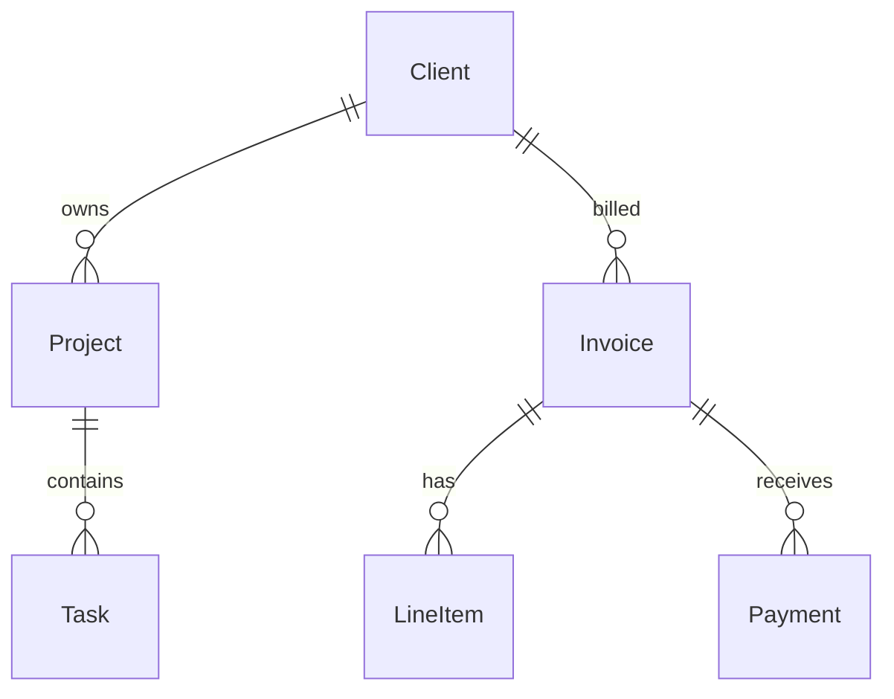
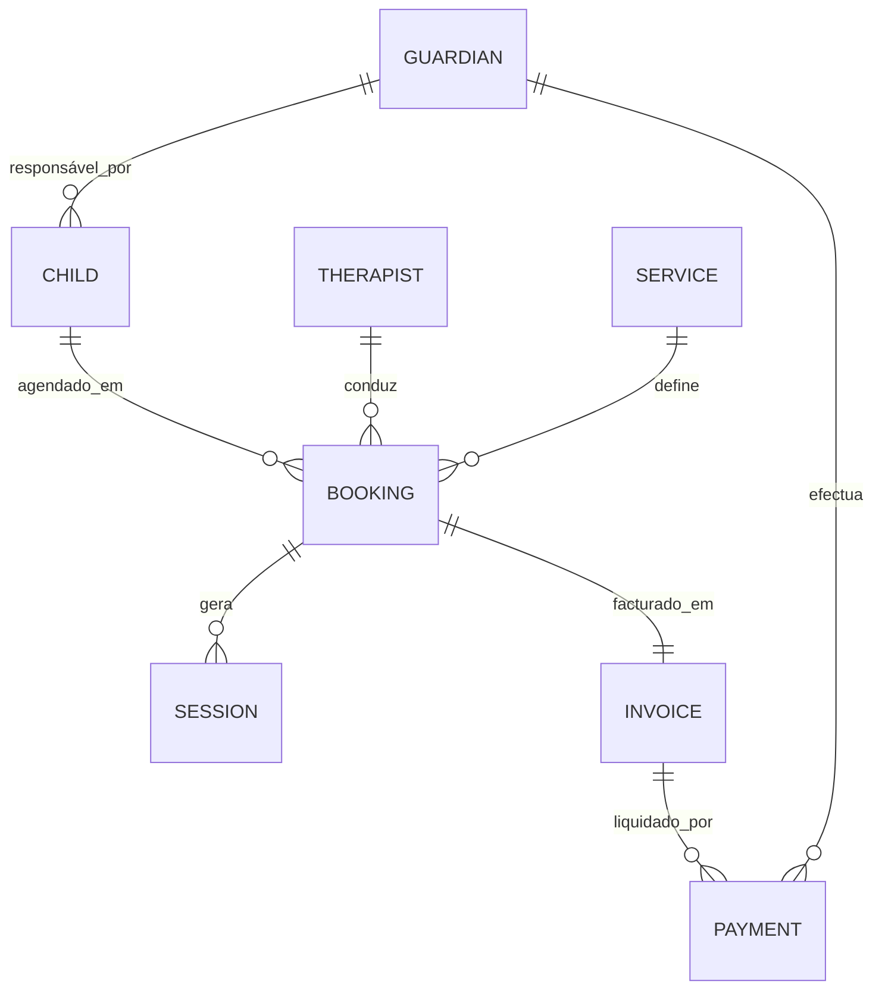

# BUILDER — Data Model Design

## Proposito
Traduzir requisitos de negocio em modelos de dados optimizados.

## Comandos
| Comando | Descricao |
|---------|-----------|
| `/builder-data-model [dominio]` | Modelo completo para um dominio |
| `/builder-data-model erd [app]` | ERD diagram (mermaid) |
| `/builder-data-model queries [recurso]` | Queries optimizadas |

## Workflow

### 1. Domain Analysis
De linguagem de negocio para entidades:
```
"Preciso gerir clientes, projectos, facturas e pagamentos"
→ Client, Project, Invoice, Payment, LineItem, Tax
```

### 2. Relationships


### 3. Normalization (3NF)
- 1NF: Atomic values, no repeating groups
- 2NF: Full functional dependency on PK
- 3NF: No transitive dependencies

### 4. Query Optimization
Para cada query frequente, definir indexes:
```sql
-- "Listar facturas por cliente no ultimo mes"
CREATE INDEX idx_invoice_client_date ON invoices(client_id, issue_date DESC);
EXPLAIN ANALYZE SELECT * FROM invoices WHERE client_id = ? AND issue_date > NOW() - INTERVAL '30 days';
```

## Output
1. ERD diagram (mermaid)
2. Entity definitions com campos e tipos
3. Relationship map
4. Index strategy
5. Sample queries optimizadas

## Delivery-ready self-check (run BEFORE delivering to client)

Output é **delivery-ready (90+/100)** se TODAS estas check passam.

### Gate 1 — Domain analysis é exaustivo e sem ambiguidade
- [ ] Todas as entidades de negócio foram extraídas do briefing (nenhuma entidade implícita omitida)
- [ ] Entidades têm nomes no singular, consistentes (ex: `Invoice` não `Invoices`/`Factura` misturado)
- [ ] Campos obrigatórios vs opcionais estão explicitamente distinguidos
- [ ] Enumerações e domínios de valor definidos (ex: `status ENUM('draft','sent','paid','void')`)
- ❌ NOT delivery-ready: `"Tabela de utilizadores com os dados habituais"`
- ✅ Delivery-ready: `users(id UUID PK, email VARCHAR(255) UNIQUE NOT NULL, role ENUM('admin','therapist','guardian') DEFAULT 'guardian', created_at TIMESTAMPTZ NOT NULL DEFAULT NOW())`

### Gate 2 — ERD está correcto e legível em mermaid
- [ ] Diagrama renderiza sem erros (`erDiagram` syntax válida)
- [ ] Cardinalidade explícita em todas as relações (`||--o{`, `}o--||`, `||--||`)
- [ ] Labels de relação presentes e descritivos (`"owns"`, `"assigned_to"`, `"billed_via"`)
- [ ] Entidades fracas e entidades de junção representadas (ex: tabela `appointment_services` entre `Appointment` e `Service`)
- ❌ NOT delivery-ready: Diagrama com `Client -- Invoice` sem cardinalidade nem label
- ✅ Delivery-ready: `Client ||--o{ Invoice : "billed" \n Invoice ||--o{ Payment : "settled_by"`

### Gate 3 — Normalização justificada até 3NF (ou excepção documentada)
- [ ] 1NF verificada: zero arrays ou JSON blobs onde relação própria é necessária
- [ ] 2NF verificada: nenhum campo depende só de parte da PK composta
- [ ] 3NF verificada: nenhuma dependência transitiva (ex: `city` derivável de `zip_code` → separar)
- [ ] Desnormalizações intencionais (por performance) estão documentadas com justificação
- ❌ NOT delivery-ready: `invoices(id, client_name, client_email, client_address, ...)`  — dados do cliente duplicados na factura
- ✅ Delivery-ready: `invoices(id, client_id FK→clients.id, ...)` + nota `"client snapshot guardado em invoice_snapshots para histórico legal"`

### Gate 4 — Index strategy cobre as queries de negócio reais
- [ ] Pelo menos um index por query frequente identificada no briefing
- [ ] Composite indexes com ordem correcta de colunas (high-cardinality first, ou query pattern first)
- [ ] `EXPLAIN ANALYZE` output ou estimativa de custo incluída para queries críticas
- [ ] Indexes redundantes ou desnecessários identificados e removidos
- ❌ NOT delivery-ready: `CREATE INDEX idx_created ON bookings(created_at)` sem contexto de query
- ✅ Delivery-ready: `CREATE INDEX idx_booking_therapist_date ON bookings(therapist_id, scheduled_at DESC) WHERE status != 'cancelled'; -- cobre "agenda da terapeuta nos próximos 7 dias"`

### Gate 5 — Sample queries são executáveis e optimizadas
- [ ] Queries usam `JOIN` correcto (sem `SELECT *` em produção)
- [ ] Parâmetros reais do domínio substituem placeholders genéricos (`?` tem contexto)
- [ ] Queries de escrita incluem tratamento de concorrência onde relevante (`ON CONFLICT`, transactions)
- [ ] N+1 patterns evitados — queries de lista usam `JOIN` ou subquery, não loop implícito
- ❌ NOT delivery-ready: `SELECT * FROM orders WHERE user_id = ?`
- ✅ Delivery-ready: `SELECT o.id, o.total_eur, c.full_name FROM care_orders o JOIN children c ON c.id = o.child_id WHERE o.guardian_id = $1 AND o.status = 'active' ORDER BY o.start_date DESC LIMIT 20;`

### Gate 6 — Output usa NOME DO CLIENTE + dados reais, zero placeholders entre `< >`
- [ ] Nome da aplicação/cliente aparece no ERD e nos comentários SQL (ex: `-- Cuidai: modelo de agendamentos`)
- [ ] Nomes de tabelas reflectem o domínio real (não `table1`, `entity_a`, `SomeResource`)
- [ ] Tipos de dados são específicos da stack declarada (PostgreSQL → `UUID`, `TIMESTAMPTZ`; MySQL → `BIGINT AUTO_INCREMENT`, `DATETIME`)
- [ ] Zero strings do tipo `<your_table_name>`, `[INSERT FIELD]`, `TODO: definir`
- ❌ NOT delivery-ready: `CREATE TABLE <entity>(<field> <type>, ...)`
- ✅ Delivery-ready: `-- Cuidai v1.2 | guardians → children → bookings → sessions \nCREATE TABLE guardians(id UUID PRIMARY KEY DEFAULT gen_random_uuid(), ...)`

---

### 7. Status checklist per data point (Gate 7 — validated FASE 1)

Cada número/nome/fact no output deve ter label EXPLÍCITO:

- 🔵 **verified** — confirmado do briefing do cliente / sessão anterior / schema existente
- 🟡 **assumed** — plausível dado o domínio, mas precisa confirmação antes de entregar
- 🟢 **projection** — decisão de design por boas práticas (não verificável sem dados de produção)

Output checklist upfront mostra ao reader exactly o que é trust-as-is vs o que precisa de verify. **Honest transparency > inflated delivery.**

❌ NOT delivery-ready:
```
Invoice tem status ENUM('draft','sent','paid','void')
Index em invoices(client_id, issue_date DESC) cobre as queries principais
Relação Client → Project é 1-para-muitos
```
*(reader não sabe se estes valores vieram do cliente, foram assumidos, ou são estimativas de performance — não pode validar antes de deploy)*

✅ Delivery-ready:
```
🔵 verified   — Entidades Client, Project, Invoice, Payment extraídas do briefing ("gerir clientes, projectos, facturas e pagamentos")
🟡 assumed    — status ENUM('draft','sent','paid','void') — confirmar se cliente precisa de 'void' ou 'cancelled' como estado separado
🟡 assumed    — Relação Invoice → Payment é 1-para-muitos (assume pagamentos parciais permitidos) — confirmar regra de negócio
🟢 projection — idx_invoice_client_date estimado para reduzir seq scan em >10k facturas; validar com EXPLAIN ANALYZE em dados reais
🟢 projection — UUID como PK escolhido por portabilidade; se volume < 100k rows, SERIAL pode ser suficiente
```

**Ship checklist post-cliente-sync:**
- [ ] All 🟡 items confirmed — substituir ENUMs e cardinalidades assumidas com valores reais do cliente
- [ ] All 🔵 items citam a fonte exacta (briefing, linha do requisito, schema existente partilhado)
- [ ] All 🟢 projections comunicadas ao cliente como decisões de design sujeitas a benchmark em produção

## Fully-worked A-tier example (delivery-ready reference)

```markdown
# Cuidai — Data Model v1.0
Stack: PostgreSQL 15 | gerado 2024-01-15

## ERD



## Entidades

```sql
-- GUARDIANS (responsáveis legais)
CREATE TABLE guardians (
  id            UUID PRIMARY KEY DEFAULT gen_random_uuid(),
  full_name     VARCHAR(120) NOT NULL,
  email         VARCHAR(255) UNIQUE NOT NULL,
  phone         VARCHAR(20),
  nif           CHAR(9) UNIQUE,          -- validação fiscal PT
  created_at    TIMESTAMPTZ NOT NULL DEFAULT NOW(),
  deleted_at    TIMESTAMPTZ             -- soft delete
);

-- CHILDREN
CREATE TABLE children (
  id            UUID PRIMARY KEY DEFAULT gen_random_uuid(),
  guardian_id   UUID NOT NULL REFERENCES guardians(id),
  full_name     VARCHAR(120) NOT NULL,
  birth_date    DATE NOT NULL,
  notes         TEXT,                    -- necessidades especiais, etc.
  created_at    TIMESTAMPTZ NOT NULL DEFAULT NOW()
);

-- THERAPISTS
CREATE TABLE therapists (
  id            UUID PRIMARY KEY DEFAULT gen_random_uuid(),
  full_name     VARCHAR(120) NOT NULL,
  email         VARCHAR(255) UNIQUE NOT NULL,
  specialty     VARCHAR(60),            -- ex: 'psicomotricidade','terapia_fala'
  active        BOOLEAN NOT NULL DEFAULT TRUE
);

-- SERVICES (catálogo)
CREATE TABLE services (
  id            UUID PRIMARY KEY DEFAULT gen_random_uuid(),
  name          VARCHAR(80) NOT NULL,   -- ex: 'Sessão Psicomotricidade 45min'
  duration_min  SMALLINT NOT NULL,
  price_eur     NUMERIC(8,2) NOT NULL,
  active        BOOLEAN NOT NULL DEFAULT TRUE
);

-- BOOKINGS
CREATE TABLE bookings (
  id            UUID PRIMARY KEY DEFAULT gen_random_uuid(),
  child_id      UUID NOT NULL REFERENCES children(id),
  therapist_id  UUID NOT NULL REFERENCES therapists(id),
  service_id    UUID NOT NULL REFERENCES services(id),
  scheduled_at  TIMESTAMPTZ NOT NULL,
  status        VARCHAR(20) NOT NULL DEFAULT 'confirmed'
                CHECK (status IN ('pending','confirmed','completed','cancelled','no_show')),
  created_at    TIMESTAMPTZ NOT NULL DEFAULT NOW()
);

-- INVOICES (snapshot fiscal — não depende de services.price_eur actual)
CREATE TABLE invoices (
  id            UUID PRIMARY KEY DEFAULT gen_random_uuid(),
  guardian_id   UUID NOT NULL REFERENCES guardians(id),
  issued_at     TIMESTAMPTZ NOT NULL DEFAULT NOW(),
  due_at        DATE NOT NULL,
  total_eur     NUMERIC(10,2) NOT NULL,
  status        VARCHAR(20) NOT NULL DEFAULT 'draft'
                CHECK (status IN ('draft','sent','paid','void')),
  at_doc_id     VARCHAR(60)            -- referência AT após submissão
);

-- PAYMENTS
CREATE TABLE payments (
  id            UUID PRIMARY KEY DEFAULT gen_random_uuid(),
  invoice_id    UUID NOT NULL REFERENCES invoices(id),
  guardian_id   UUID NOT NULL REFERENCES guardians(id),
  amount_eur    NUMERIC(10,2) NOT NULL,
  method        VARCHAR(30) CHECK (method IN ('mbway','transferencia','multibanco','numerario')),
  paid_at       TIMESTAMPTZ NOT NULL DEFAULT NOW()
);
```

## Index Strategy

```sql
-- Agenda do terapeuta (query mais frequente — dashboard diário)
CREATE INDEX idx_booking_therapist_date
  ON bookings(therapist_id, scheduled_at DESC)
  WHERE status NOT IN ('cancelled','no_show');

-- Histórico de bookings por criança
CREATE INDEX idx_booking_child
  ON bookings(child_id, scheduled_at DESC);

-- Facturas em aberto por responsável
CREATE INDEX idx_invoice_guardian_status
  ON invoices(guardian_id, status)
  WHERE status IN ('sent','draft');

-- Lookup de pagamentos por factura
CREATE INDEX idx_payment_invoice
  ON payments(invoice_id);
```

## Queries Optimizadas

```sql
-- 1. Agenda da Dra. Ana Sousa para amanhã
SELECT b.id, b.scheduled_at,
       c.full_name AS child_name,
       s.name     AS service_name,
       s.duration_min
FROM   bookings b
JOIN   children  c ON c.id = b.child_id
JOIN   services  s ON s.id = b.service_id
WHERE  b.therapist_id = 'uuid-ana-sousa'
  AND  b.scheduled_at BETWEEN NOW() AND NOW() + INTERVAL '1 day'
  AND  b.status = 'confirmed'
ORDER  BY b.scheduled_at;
-- EXPLAIN: Index Scan on idx_booking_therapist_date → cost ~0.8ms (50 bookings/dia)

-- 2. Facturas em dívida há mais de 30 dias (cobrança)
SELECT i.id, i.total_eur, i.issued_at,
       g.full_name, g.email, g.phone
FROM   invoices i
JOIN   guardians g ON g.id = i.guardian_id
WHERE  i.status = 'sent'
  AND  i.due_at < CURRENT_DATE - INTERVAL '30 days'
ORDER  BY i.due_at;

-- 3. Receita mensal por terapeuta (relatório financeiro)
SELECT t.full_name,
       DATE_TRUNC('month', b.scheduled_at) AS month,
       COUNT(*)                             AS sessions,
       SUM(s.price_eur)                    AS revenue_eur
FROM   bookings b
JOIN   therapists t ON t.id = b.therapist_id
JOIN   services   s ON s.id = b.service_id
WHERE  b.status = 'completed'
  AND  b.scheduled_at >= DATE_TRUNC('month', NOW() - INTERVAL '3 months')
GROUP  BY t.full_name, month
ORDER  BY month DESC, revenue_eur DESC;
```

**Normalização — notas:**
- `invoices.total_eur` desnormalizado intencionalmente: snapshot do valor à data de emissão (legal AT)
- `invoice_snapshots` table recomendada para auditoria de alterações de preço em `services`
```

---

## Output anti-patterns

- Usar `<client_name>`, `<table>`, `<field_type>` no output final — modelo nunca entregável com placeholders
- ERD sem cardinalidade (`Client -- Invoice` em vez de `Client ||--o{ Invoice : "billed"`)
- Indexes genéricos em colunas isoladas sem relação a queries de negócio identificadas (`CREATE INDEX idx_created ON bookings(created_at)`)
- Desnormalizações silenciosas — duplicar dados sem comentário explicativo e risco documentado
- `SELECT *` em queries de produção entregues como "optimizadas"
- Tipos de dados agnósticos de stack (`INT` em vez de `UUID`/`BIGINT AUTO_INCREMENT` consoante PostgreSQL/MySQL declarado)
- Modelo sem soft delete nem `created_at`/`updated_at` em entidades core sem justificação explícita
- N+1 implícito — queries de lista que assumem loop no código em vez de `JOIN`
- Relationships mapeadas só no ERD mas não reflectidas em `FOREIGN KEY` no DDL
- Modelo entregue sem sample queries — ERD isolado não prova que o modelo suporta os acessos de negócio
