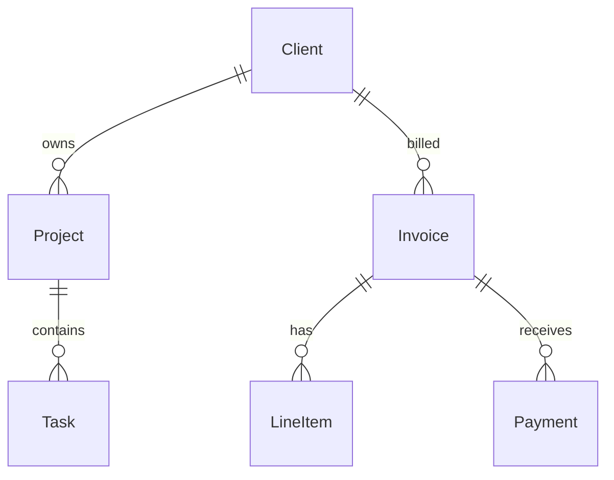

# BUILDER — Data Model Design

## Proposito
Traduzir requisitos de negocio em modelos de dados optimizados.

## Comandos
| Comando | Descricao |
|---------|-----------|
| `/builder-data-model [dominio]` | Modelo completo para um dominio |
| `/builder-data-model erd [app]` | ERD diagram (mermaid) |
| `/builder-data-model queries [recurso]` | Queries optimizadas |

## Workflow

### 1. Domain Analysis
De linguagem de negocio para entidades:
```
"Preciso gerir clientes, projectos, facturas e pagamentos"
→ Client, Project, Invoice, Payment, LineItem, Tax
```

### 2. Relationships


### 3. Normalization (3NF)
- 1NF: Atomic values, no repeating groups
- 2NF: Full functional dependency on PK
- 3NF: No transitive dependencies

### 4. Query Optimization
Para cada query frequente, definir indexes:
```sql
-- "Listar facturas por cliente no ultimo mes"
CREATE INDEX idx_invoice_client_date ON invoices(client_id, issue_date DESC);
EXPLAIN ANALYZE SELECT * FROM invoices WHERE client_id = ? AND issue_date > NOW() - INTERVAL '30 days';
```

## Output
1. ERD diagram (mermaid)
2. Entity definitions com campos e tipos
3. Relationship map
4. Index strategy
5. Sample queries optimizadas
