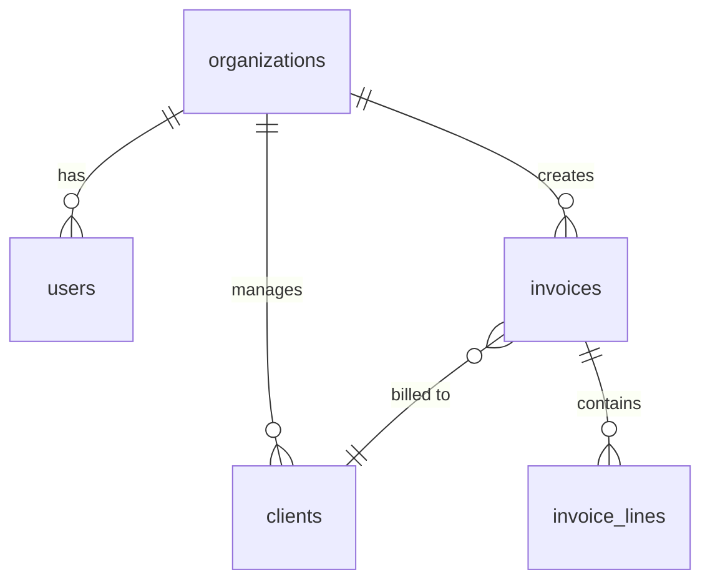

# BUILDER — Database Schema Design

## Proposito
Gerar schemas de DB COMPLETOS — tabelas, relacoes, indexes, constraints, migrations, seeds.
Suporta: **PostgreSQL** (producao), **SQLite** (development/embedded).

## Comandos
| Comando | Descricao |
|---------|-----------|
| `/builder-database-schema [app]` | Schema completo para uma app |
| `/builder-database-schema table [nome]` | Tabela individual com constraints |
| `/builder-database-schema migrate [from] [to]` | Migration entre versoes |

## Workflow

### 1. Entity Mapping
De requisitos para entidades:
```
App: "SaaS de contabilidade"
→ users, organizations, invoices, clients, transactions, categories, tax_rules
```

### 2. Generate DDL

```sql
-- PostgreSQL
CREATE TABLE organizations (
    id UUID PRIMARY KEY DEFAULT gen_random_uuid(),
    name VARCHAR(200) NOT NULL,
    nif VARCHAR(9) UNIQUE,
    plan VARCHAR(20) DEFAULT 'starter' CHECK (plan IN ('starter', 'pro', 'enterprise')),
    created_at TIMESTAMPTZ DEFAULT NOW(),
    updated_at TIMESTAMPTZ DEFAULT NOW()
);

CREATE TABLE users (
    id UUID PRIMARY KEY DEFAULT gen_random_uuid(),
    org_id UUID NOT NULL REFERENCES organizations(id) ON DELETE CASCADE,
    email VARCHAR(255) UNIQUE NOT NULL,
    name VARCHAR(200) NOT NULL,
    role VARCHAR(20) DEFAULT 'member' CHECK (role IN ('admin', 'member', 'viewer')),
    password_hash VARCHAR(255) NOT NULL,
    last_login TIMESTAMPTZ,
    created_at TIMESTAMPTZ DEFAULT NOW()
);

CREATE TABLE invoices (
    id UUID PRIMARY KEY DEFAULT gen_random_uuid(),
    org_id UUID NOT NULL REFERENCES organizations(id),
    client_id UUID NOT NULL REFERENCES clients(id),
    invoice_number VARCHAR(30) NOT NULL,
    atcud VARCHAR(20),
    status VARCHAR(20) DEFAULT 'draft' CHECK (status IN ('draft', 'sent', 'paid', 'overdue', 'cancelled')),
    net_total DECIMAL(12,2) NOT NULL DEFAULT 0,
    tax_total DECIMAL(12,2) NOT NULL DEFAULT 0,
    gross_total DECIMAL(12,2) GENERATED ALWAYS AS (net_total + tax_total) STORED,
    issue_date DATE NOT NULL DEFAULT CURRENT_DATE,
    due_date DATE,
    paid_date DATE,
    UNIQUE(org_id, invoice_number)
);

-- Indexes
CREATE INDEX idx_invoices_org ON invoices(org_id);
CREATE INDEX idx_invoices_status ON invoices(org_id, status);
CREATE INDEX idx_invoices_due ON invoices(due_date) WHERE status = 'sent';
CREATE INDEX idx_users_email ON users(email);
```

### 3. Mermaid ERD


### 4. Migration Files (Drizzle/Prisma/raw SQL)

### 5. Seed Data (development)

## Output
1. `schema.sql` (full DDL)
2. `migrations/001_initial.sql`
3. `seed.sql` (sample data)
4. `ERD.md` (mermaid diagram)
5. `INDEXES.md` (justification for each index)

## Red Flags
- Sem UUID para primary keys — sequencial expoe contagem
- Sem ON DELETE cascade/restrict — orphan rows
- Sem indexes em foreign keys — JOIN performance
- Sem CHECK constraints — invalid data enters
- Sem timestamps (created_at, updated_at) — zero auditability
- Decimal como FLOAT — rounding errors em valores monetarios (USAR DECIMAL)
