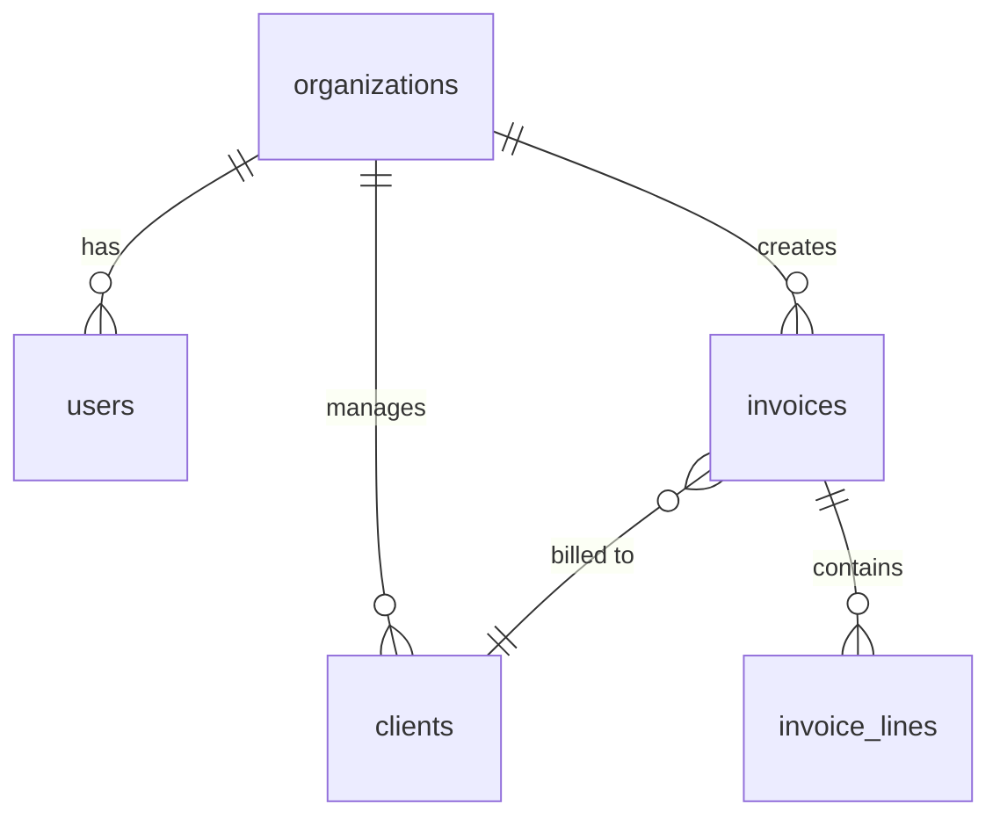

# BUILDER — Database Schema Design

## Proposito
Gerar schemas de DB COMPLETOS — tabelas, relacoes, indexes, constraints, migrations, seeds.
Suporta: **PostgreSQL** (producao), **SQLite** (development/embedded).

## Comandos
| Comando | Descricao |
|---------|-----------|
| `/builder-database-schema [app]` | Schema completo para uma app |
| `/builder-database-schema table [nome]` | Tabela individual com constraints |
| `/builder-database-schema migrate [from] [to]` | Migration entre versoes |

## Workflow

### 1. Entity Mapping
De requisitos para entidades:
```
App: "SaaS de contabilidade"
→ users, organizations, invoices, clients, transactions, categories, tax_rules
```

### 2. Generate DDL

```sql
-- PostgreSQL
CREATE TABLE organizations (
    id UUID PRIMARY KEY DEFAULT gen_random_uuid(),
    name VARCHAR(200) NOT NULL,
    nif VARCHAR(9) UNIQUE,
    plan VARCHAR(20) DEFAULT 'starter' CHECK (plan IN ('starter', 'pro', 'enterprise')),
    created_at TIMESTAMPTZ DEFAULT NOW(),
    updated_at TIMESTAMPTZ DEFAULT NOW()
);

CREATE TABLE users (
    id UUID PRIMARY KEY DEFAULT gen_random_uuid(),
    org_id UUID NOT NULL REFERENCES organizations(id) ON DELETE CASCADE,
    email VARCHAR(255) UNIQUE NOT NULL,
    name VARCHAR(200) NOT NULL,
    role VARCHAR(20) DEFAULT 'member' CHECK (role IN ('admin', 'member', 'viewer')),
    password_hash VARCHAR(255) NOT NULL,
    last_login TIMESTAMPTZ,
    created_at TIMESTAMPTZ DEFAULT NOW()
);

CREATE TABLE invoices (
    id UUID PRIMARY KEY DEFAULT gen_random_uuid(),
    org_id UUID NOT NULL REFERENCES organizations(id),
    client_id UUID NOT NULL REFERENCES clients(id),
    invoice_number VARCHAR(30) NOT NULL,
    atcud VARCHAR(20),
    status VARCHAR(20) DEFAULT 'draft' CHECK (status IN ('draft', 'sent', 'paid', 'overdue', 'cancelled')),
    net_total DECIMAL(12,2) NOT NULL DEFAULT 0,
    tax_total DECIMAL(12,2) NOT NULL DEFAULT 0,
    gross_total DECIMAL(12,2) GENERATED ALWAYS AS (net_total + tax_total) STORED,
    issue_date DATE NOT NULL DEFAULT CURRENT_DATE,
    due_date DATE,
    paid_date DATE,
    UNIQUE(org_id, invoice_number)
);

-- Indexes
CREATE INDEX idx_invoices_org ON invoices(org_id);
CREATE INDEX idx_invoices_status ON invoices(org_id, status);
CREATE INDEX idx_invoices_due ON invoices(due_date) WHERE status = 'sent';
CREATE INDEX idx_users_email ON users(email);
```

### 3. Mermaid ERD


### 4. Migration Files (Drizzle/Prisma/raw SQL)

### 5. Seed Data (development)

## Output
1. `schema.sql` (full DDL)
2. `migrations/001_initial.sql`
3. `seed.sql` (sample data)
4. `ERD.md` (mermaid diagram)
5. `INDEXES.md` (justification for each index)

## Red Flags
- Sem UUID para primary keys — sequencial expoe contagem
- Sem ON DELETE cascade/restrict — orphan rows
- Sem indexes em foreign keys — JOIN performance
- Sem CHECK constraints — invalid data enters
- Sem timestamps (created_at, updated_at) — zero auditability
- Decimal como FLOAT — rounding errors em valores monetarios (USAR DECIMAL)

## Delivery-ready self-check (run BEFORE delivering to client)

Output é **delivery-ready (90+/100)** se TODAS estas check passam.

### Gate 1 — Entidades completas e relacionamentos correctos
- [ ] Todas as entidades mencionadas nos requisitos têm tabela correspondente (sem entidade "esquecida")
- [ ] Cada FK tem a política ON DELETE explícita (CASCADE, RESTRICT ou SET NULL) — nunca omitida
- [ ] Relacionamentos N:M têm tabela de junção com PKs compostas ou UUID próprio
- [ ] Nenhuma coluna guarda múltiplos valores (arrays de IDs como string, etc.)
- ❌ NOT delivery-ready: `client_id INTEGER REFERENCES clients(id)` — sem ON DELETE
- ✅ Delivery-ready: `client_id UUID NOT NULL REFERENCES clients(id) ON DELETE RESTRICT`

### Gate 2 — Tipos de dados sem erros monetários ou de precisão
- [ ] Valores monetários usam `DECIMAL(12,2)` — nunca `FLOAT` ou `REAL`
- [ ] Datas de negócio usam `DATE`; timestamps de sistema usam `TIMESTAMPTZ`
- [ ] NIFs, códigos postais e telefones são `VARCHAR` — nunca `INTEGER`
- [ ] Colunas booleanas usam `BOOLEAN` com `DEFAULT FALSE` explícito
- ❌ NOT delivery-ready: `net_total FLOAT` — rounding errors em facturas acima de €1 000
- ✅ Delivery-ready: `net_total DECIMAL(12,2) NOT NULL DEFAULT 0`, `gross_total DECIMAL(12,2) GENERATED ALWAYS AS (net_total + tax_total) STORED`

### Gate 3 — Indexes justificados e completos
- [ ] Todas as colunas FK têm índice (ex: `CREATE INDEX idx_invoices_org ON invoices(org_id)`)
- [ ] Índices de filtragem frequente têm cláusula `WHERE` parcial quando aplicável
- [ ] `INDEXES.md` lista cada índice com justificação (query que suporta, ganho estimado)
- [ ] Nenhum índice duplica a PK ou unique constraint já existente
- ❌ NOT delivery-ready: tabela `invoice_lines` com `invoice_id UUID REFERENCES invoices(id)` sem índice
- ✅ Delivery-ready: `CREATE INDEX idx_invoice_lines_invoice ON invoice_lines(invoice_id);` + entrada em `INDEXES.md`: "suporta JOIN invoices→lines, ~40k linhas/org"

### Gate 4 — Constraints e integridade de dados
- [ ] Colunas de estado/enum têm `CHECK` constraint com todos os valores válidos listados
- [ ] Campos obrigatórios de negócio têm `NOT NULL` (não deixar ao ORM decidir)
- [ ] Unicidades de negócio têm `UNIQUE` ou `UNIQUE(col_a, col_b)` compostos
- [ ] PKs usam `UUID DEFAULT gen_random_uuid()` — nunca SERIAL exposto
- ❌ NOT delivery-ready: `status VARCHAR(20)` — aceita `'xpto'` sem rejeição
- ✅ Delivery-ready: `status VARCHAR(20) DEFAULT 'draft' CHECK (status IN ('draft', 'sent', 'paid', 'overdue', 'cancelled'))`

### Gate 5 — Ficheiros de output gerados e funcionais
- [ ] `schema.sql` corre sem erros em PostgreSQL 15+ (testado via `psql` ou `\i`)
- [ ] `migrations/001_initial.sql` é idempotente (`CREATE TABLE IF NOT EXISTS` ou equivalente)
- [ ] `seed.sql` insere dados coerentes (FKs satisfeitas, datas realistas, NIFs válidos PT)
- [ ] `ERD.md` renderiza sem erros no Mermaid live editor
- ❌ NOT delivery-ready: `seed.sql` com `org_id = '123'` quando a tabela usa UUID
- ✅ Delivery-ready: `INSERT INTO organizations (id, name, nif) VALUES ('a1b2c3d4-...', 'Cuidai Lda', '512345678');` seguido de users/invoices que referenciam esse UUID

### Gate 6 — Output usa NOME DO CLIENTE + dados reais, sem placeholders angle-brackets
- [ ] Zero ocorrências de `<nome>`, `<org>`, `<email>`, `<table_name>` no output final
- [ ] Nome da app/cliente aparece nos comentários do schema e no `ERD.md`
- [ ] NIFs de seed são numericamente válidos (9 dígitos, formato PT)
- [ ] Datas de seed são realistas (não `2000-01-01` genérico)
- ❌ NOT delivery-ready: `-- Schema para <app_name>` / `nif VARCHAR(9) -- preencher depois`
- ✅ Delivery-ready: `-- Schema: LUSOconta v1.0 — gerado 2025-06-10` / `nif VARCHAR(9) UNIQUE CHECK (nif ~ '^\d{9}$')`

---

## Fully-worked A-tier example (delivery-ready reference)

```markdown
-- ============================================================
-- Schema: LUSOconta v1.0
-- Base: PostgreSQL 15+  |  Gerado: 2025-06-10
-- Entidades: organizations, users, clients, invoices, invoice_lines
-- ============================================================

CREATE EXTENSION IF NOT EXISTS "pgcrypto";

CREATE TABLE organizations (
    id          UUID PRIMARY KEY DEFAULT gen_random_uuid(),
    name        VARCHAR(200) NOT NULL,
    nif         VARCHAR(9)   UNIQUE CHECK (nif ~ '^\d{9}$'),
    plan        VARCHAR(20)  NOT NULL DEFAULT 'starter'
                    CHECK (plan IN ('starter', 'pro', 'enterprise')),
    created_at  TIMESTAMPTZ  NOT NULL DEFAULT NOW(),
    updated_at  TIMESTAMPTZ  NOT NULL DEFAULT NOW()
);

CREATE TABLE users (
    id            UUID PRIMARY KEY DEFAULT gen_random_uuid(),
    org_id        UUID         NOT NULL REFERENCES organizations(id) ON DELETE CASCADE,
    email         VARCHAR(255) NOT NULL UNIQUE,
    name          VARCHAR(200) NOT NULL,
    role          VARCHAR(20)  NOT NULL DEFAULT 'member'
                      CHECK (role IN ('admin', 'member', 'viewer')),
    password_hash VARCHAR(255) NOT NULL,
    last_login    TIMESTAMPTZ,
    created_at    TIMESTAMPTZ  NOT NULL DEFAULT NOW()
);

CREATE TABLE clients (
    id         UUID PRIMARY KEY DEFAULT gen_random_uuid(),
    org_id     UUID         NOT NULL REFERENCES organizations(id) ON DELETE CASCADE,
    name       VARCHAR(200) NOT NULL,
    nif        VARCHAR(9)   CHECK (nif ~ '^\d{9}$'),
    email      VARCHAR(255),
    created_at TIMESTAMPTZ  NOT NULL DEFAULT NOW()
);

CREATE TABLE invoices (
    id             UUID PRIMARY KEY DEFAULT gen_random_uuid(),
    org_id         UUID          NOT NULL REFERENCES organizations(id) ON DELETE RESTRICT,
    client_id      UUID          NOT NULL REFERENCES clients(id) ON DELETE RESTRICT,
    invoice_number VARCHAR(30)   NOT NULL,
    atcud          VARCHAR(20),
    status         VARCHAR(20)   NOT NULL DEFAULT 'draft'
                       CHECK (status IN ('draft','sent','paid','overdue','cancelled')),
    net_total      DECIMAL(12,2) NOT NULL DEFAULT 0,
    tax_total      DECIMAL(12,2) NOT NULL DEFAULT 0,
    gross_total    DECIMAL(12,2) GENERATED ALWAYS AS (net_total + tax_total) STORED,
    issue_date     DATE          NOT NULL DEFAULT CURRENT_DATE,
    due_date       DATE,
    paid_date      DATE,
    UNIQUE (org_id, invoice_number)
);

CREATE TABLE invoice_lines (
    id          UUID PRIMARY KEY DEFAULT gen_random_uuid(),
    invoice_id  UUID          NOT NULL REFERENCES invoices(id) ON DELETE CASCADE,
    description VARCHAR(500)  NOT NULL,
    quantity    DECIMAL(10,3) NOT NULL DEFAULT 1,
    unit_price  DECIMAL(12,2) NOT NULL,
    tax_rate    DECIMAL(5,2)  NOT NULL DEFAULT 23.00,
    line_total  DECIMAL(12,2) GENERATED ALWAYS AS (quantity * unit_price) STORED
);

-- Indexes
CREATE INDEX idx_users_org         ON users(org_id);
CREATE INDEX idx_clients_org       ON clients(org_id);
CREATE INDEX idx_invoices_org      ON invoices(org_id);
CREATE INDEX idx_invoices_status   ON invoices(org_id, status);
CREATE INDEX idx_invoices_due      ON invoices(due_date) WHERE status = 'sent';
CREATE INDEX idx_invoice_lines_inv ON invoice_lines(invoice_id);

-- ============================================================
-- seed.sql — LUSOconta development data
-- ============================================================
INSERT INTO organizations (id, name, nif, plan) VALUES
  ('d4e5f6a7-0001-4b8c-9d2e-000000000001', 'LUSOconta Demo Lda', '512345678', 'pro');

INSERT INTO users (id, org_id, email, name, role, password_hash) VALUES
  ('d4e5f6a7-0002-4b8c-9d2e-000000000002',
   'd4e5f6a7-0001-4b8c-9d2e-000000000001',
   'admin@lusoconta.pt', 'Ana Ferreira', 'admin',
   '$2b$10$placeholderHashForDevOnly');

INSERT INTO clients (id, org_id, name, nif, email) VALUES
  ('d4e5f6a7-0003-4b8c-9d2e-000000000003',
   'd4e5f6a7-0001-4b8c-9d2e-000000000001',
   'Atrium Saúde SA', '509876543', 'financeiro@atrium.pt');

INSERT INTO invoices (id, org_id, client_id, invoice_number, status, net_total, tax_total, issue_date, due_date) VALUES
  ('d4e5f6a7-0004-4b8c-9d2e-000000000004',
   'd4e5f6a7-0001-4b8c-9d2e-000000000001',
   'd4e5f6a7-0003-4b8c-9d2e-000000000003',
   'FT 2025/0001', 'sent', 1200.00, 276.00, '2025-06-01', '2025-06-30');
```

---

## Output anti-patterns

- Usar `SERIAL` ou `INTEGER` como PK — expõe contagem de registos, bloqueia sharding futuro
- `FLOAT`/`REAL` em colunas monetárias — erros de arredondamento acima de €999.99
- FK sem `ON DELETE` explícito — comportamento depende do SGBD, orphan rows silenciosos
- `CHECK` constraint omitida em colunas de estado — qualquer string inválida entra sem erro
- `seed.sql` com UUIDs não referenciados (FK violations ao correr por ordem errada)
- Index em todas as colunas "por precaução" — sem justificação em `INDEXES.md`, overhead de escrita
- Timestamps como `DATE` em vez de `TIMESTAMPTZ` — perde timezone, bugs em apps multi-região
- Placeholders `<org_name>`, `<table>` no output final entregue ao cliente
- ERD Mermaid com sintaxe incorrecta (aspas, caracteres especiais) que não renderiza
- `schema.sql` nunca testado com `psql` — erros de sintaxe só descobertos pelo cliente
