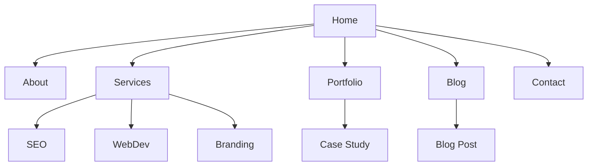

# BUILDER — Wireframe & Information Architecture

## Proposito
Mapear a estrutura ANTES do visual — wireframes, flows, sitemaps. Pensa antes de desenhar.

## Comandos
| Comando | Descricao |
|---------|-----------|
| `/builder-wireframe [pagina]` | Wireframe de uma pagina |
| `/builder-wireframe sitemap [app]` | Sitemap hierarquico |
| `/builder-wireframe flow [accao]` | User flow para uma accao |

## Wireframe Format (ASCII)

```
┌──────────────────────────────────────────┐
│  [Logo]           Nav    Nav    [CTA]    │
├──────────────────────────────────────────┤
│                                          │
│     [Badge: New Feature]                 │
│                                          │
│     ████████████████████                 │
│     Big Headline Here                    │
│     ████████████████████                 │
│                                          │
│     Subheadline text that explains       │
│     the value proposition clearly.       │
│                                          │
│     [Primary CTA]  [Secondary CTA]       │
│                                          │
│     "Trusted by 500+ companies"          │
│     [logo] [logo] [logo] [logo]          │
│                                          │
├──────────────────────────────────────────┤
│  Feature 1    Feature 2    Feature 3     │
│  [icon]       [icon]       [icon]        │
│  Title        Title        Title         │
│  Desc text    Desc text    Desc text     │
├──────────────────────────────────────────┤
```

## Sitemap (Mermaid)


## User Flow
```
[Landing] → [Click CTA] → [Pricing Page] → [Select Plan]
    → [Register Form] → [Email Verification] → [Dashboard]
```

## Output
1. ASCII wireframes per page
2. Sitemap (mermaid + text)
3. User flows (key journeys)
4. Content inventory (what text/images needed per page)

## Red Flags
- Wireframe sem hierarquia visual — tudo parece igual
- Sitemap sem profundidade maxima — user perde-se
- Flow sem error states — so o happy path
- Sem mobile wireframe — 60% do trafego

## Delivery-ready self-check (run BEFORE delivering to client)

Output é **delivery-ready (90+/100)** se TODAS estas check passam.

### Gate 1 — Hierarquia visual no wireframe ASCII
- [ ] Hero section tem peso visual distinto (tamanho de bloco, negrito, linhas duplas) dos elementos secundários
- [ ] Pelo menos 3 níveis de hierarquia visíveis (H1 > H2 > body/CTA)
- [ ] CTAs primários e secundários diferenciados visualmente (`[████ CTA PRIMÁRIO ████]` vs `[CTA Sec]`)
- [ ] Whitespace intencional — blocos separados por linhas em branco, não colados

❌ NOT delivery-ready: `│ Title │ Button │ Text │` — tudo na mesma linha, sem peso relativo  
✅ Delivery-ready:
```
│  ████████████████████████████████  │
│  Poupe até 40% nos seus impostos   │
│  ████████████████████████████████  │
│  Automatizamos a sua contabilidade │
│                                    │
│  [██ Começar grátis ██]  [Ver demo]│
```

---

### Gate 2 — Mobile wireframe presente
- [ ] Versão mobile (320-390px) desenhada para qualquer página com tráfego > 30%
- [ ] Stack vertical explícito — nav colapsado em `[☰]`, colunas reduzidas a 1
- [ ] CTAs em full-width no mobile (`[████████ CTA ████████]`)
- [ ] Imagens/media marcados com dimensão proporcional ao viewport

❌ NOT delivery-ready: Só desktop, nota de rodapé "adaptar para mobile depois"  
✅ Delivery-ready:
```
Mobile (375px) — Tributario.AI Dashboard
┌──────────────────┐
│ [Logo]      [☰]  │
├──────────────────┤
│ Olá, João Silva  │
│ IRS 2024: 87%    │
│ ██████████░░     │
│ [██ Submeter ██] │
└──────────────────┘
```

---

### Gate 3 — Sitemap com profundidade e limites claros
- [ ] Máximo 3 níveis de profundidade documentados (L1 → L2 → L3)
- [ ] Páginas orfãs identificadas (ex: `/obrigado`, `/erro-404`) no diagrama
- [ ] Versão Mermaid + versão texto/indentada ambas presentes
- [ ] Número total de páginas/ecrãs indicado no cabeçalho do sitemap

❌ NOT delivery-ready: Mermaid com só `Home → About → Contact` sem sub-páginas nem estados  
✅ Delivery-ready:
```
Sitemap — Cuidai App (v1.2) — 14 ecrãs
L1: Home / L2: Profissionais, Famílias, Como Funciona
L2: Profissionais → L3: Registo, Perfil Público, Agenda
Orphans: /obrigado-registo, /sessao-expirada
```

---

### Gate 4 — User flows com error states e edge cases
- [ ] Mínimo 1 error state por flow (ex: formulário inválido, pagamento recusado)
- [ ] Happy path + pelo menos 1 unhappy path documentados
- [ ] Cada passo tem label de acção do utilizador + label do sistema em resposta
- [ ] Ponto de entrada e ponto de saída (goal atingido / abandono) explícitos

❌ NOT delivery-ready: `[Login] → [Dashboard]` — zero estados intermédios ou erros  
✅ Delivery-ready:
```
SAQUEI — Flow Pedido de Adiantamento
[Home] → [Clica "Pedir agora"] → [Form: valor + IBAN]
  → [Validação] ──ERRO──→ [IBAN inválido — tenta outra vez]
  → [Aprovação automática] ──RECUSA──→ [Email: motivo + prazo]
  → [Contrato digital] → [Assina] → [Transferência 24h]
  ✓ Goal: dinheiro na conta
  ✗ Abandono: saiu no step Form (tracking: form_abandoned)
```

---

### Gate 5 — Content inventory por página
- [ ] Cada secção tem: tipo de conteúdo (texto, imagem, vídeo, dado dinâmico), origem (CMS / API / estático) e responsável (cliente / equipa)
- [ ] Campos dinâmicos marcados com `{variável}` vs conteúdo fixo
- [ ] Character limits indicados para headlines e meta descriptions
- [ ] Assets de imagem com ratio/dimensão mínima especificada

❌ NOT delivery-ready: Wireframe com `[imagem aqui]` sem mais contexto  
✅ Delivery-ready:
```
LUSOconta — Hero Section — Content Inventory
│ Campo            │ Tipo    │ Origem  │ Limite     │
│ Headline         │ Estático│ Cliente │ 60 chars   │
│ Subheadline      │ Estático│ Cliente │ 120 chars  │
│ CTA label        │ Estático│ Equipa  │ 20 chars   │
│ Nº clientes      │ Dinâmico│ API     │ {total_clientes} │
│ Hero image       │ Media   │ Cliente │ 1440×800px │
```

---

### Gate 6 — Output usa NOME DO CLIENTE + dados reais, sem angle-brackets placeholder
- [ ] Zero ocorrências de `[Client Name]`, `<empresa>`, `[Your Logo]`, `[Headline Here]`
- [ ] Nome da app/produto real em todos os títulos de wireframe e sitemap
- [ ] Dados de exemplo são plausíveis para o negócio (ex: valores de IRS, não "€999")
- [ ] Versão/data do wireframe indicada (ex: `v1.0 — Jan 2025`)

❌ NOT delivery-ready: `│ [Logo] Nav Nav [CTA] │` — o SKILL.md template copiado literalmente  
✅ Delivery-ready: `│ Cuidai ·  Como Funciona · Profissionais · [Registar grátis] │`

---

### 7. Status checklist per data point (Gate 7 — validated FASE 1)

Cada número/nome/fact no wireframe output deve ter label EXPLÍCITO:

- 🔵 **verified** — confirmado do briefing/sessão anterior/dados reais do cliente
- 🟡 **assumed** — plausível mas precisa confirmação do cliente antes de entregar
- 🟢 **projection** — decisão de arquitectura por design (não verificável até testar com utilizadores)

Output checklist upfront mostra ao cliente exactamente o que é trust-as-is vs o que precisa verify antes de avançar para visual design. **Honest transparency > wireframe que parece completo mas está cheio de suposições.**

❌ NOT delivery-ready: Wireframe com `"Trusted by 500+ companies"`, nav com 4 items, e flow de 6 steps — sem labels, o cliente assume que tudo foi validado e aprova.

✅ Delivery-ready:
```
Checklist — Landing Page Tributario.AI

🔵 verified  — Logo posicionado top-left (confirmado brand guide v2)
🔵 verified  — CTA primário "Começar grátis" (confirmado copy do cliente)
🟡 assumed   — "Trusted by 500+ empresas" — número a confirmar com cliente
🟡 assumed   — 3 items no nav (Produto / Preços / Entrar) — estrutura não aprovada
🟡 assumed   — Secção de depoimentos na landing — existe conteúdo real?
🟢 projection — Flow de onboarding em 4 steps (hipótese UX; validar com teste A/B)
🟢 projection — Mobile-first layout assume tráfego >60% mobile (analytics não partilhados)
```

**Ship checklist post-cliente-sync:**
- [ ] All 🟡 items confirmados — substituir copy/números assumed com actuals do cliente
- [ ] All 🔵 sources citadas — ex: "nav structure from sitemap v1.2 aprovado em [data]"
- [ ] All 🟢 projections comunicadas ao cliente como hipóteses de arquitectura a validar com utilizadores reais (não como decisões finais)

## Fully-worked A-tier example (delivery-ready reference)

```markdown
# Wireframe Package — ARRECADA.GOV v1.0 — Fev 2025
## Portal de Declaração de Bens Abandonados (14 ecrãs)

---

### SITEMAP — ARRECADA.GOV (14 ecrãs)

Mermaid:
graph TD
    Home --> ComoFunciona[Como Funciona]
    Home --> Consultar[Consultar Bens]
    Home --> Reclamar[Reclamar Bem]
    Home --> FAQ
    Consultar --> ResultadosBusca[Resultados: Lista]
    ResultadosBusca --> FichaBem[Ficha do Bem]
    Reclamar --> FormIdentidade[Form: Identidade]
    FormIdentidade --> FormDocumentos[Form: Upload Docs]
    FormDocumentos --> Confirmacao[Confirmação Pedido]
    Confirmacao --> AreaPessoal[Área Pessoal]
    AreaPessoal --> EstadoPedido[Estado do Pedido]
    Orphans: /sessao-expirada · /erro-404 · /obrigado

Profundidade máxima: L3 | Total ecrãs: 14

---

### WIREFRAME — Homepage (Desktop 1440px)

┌────────────────────────────────────────────────────┐
│  ARRECADA.GOV        Como Funciona  FAQ  [Consultar bens →] │
├────────────────────────────────────────────────────┤
│                                                    │
│  ┌─ Serviço Público Oficial ─┐                     │
│                                                    │
│  ██████████████████████████████████████            │
│  Tem dinheiro esquecido                            │
│  no Estado à sua espera?                           │
│  ██████████████████████████████████████            │
│                                                    │
│  Consulte gratuitamente bens, depósitos e          │
│  seguros não reclamados registados desde 2015.     │
│                                                    │
│  [████ Consultar pelo NIF ████]  [Como funciona]   │
│                                                    │
│  "Já devolvemos €4.2M a 18.400 cidadãos"           │
│  ★★★★★ Avaliação: 4.8/5 · Ministério das Finanças  │
│                                                    │
├────────────────────────────────────────────────────┤
│  Como funciona em 3 passos                         │
│                                                    │
│  [🔍]            [📄]            [✅]              │
│  1. Consulte     2. Identifique  3. Reclame        │
│  Introduza NIF   Veja os bens    Submeta docs      │
│  ou nome         em seu nome     em 5 minutos      │
├────────────────────────────────────────────────────┤
│  ARRECADA.GOV  ·  Política Privacidade  ·  RGPD    │
│  © 2025 República Portuguesa                       │
└────────────────────────────────────────────────────┘

---

### WIREFRAME — Homepage (Mobile 375px)

┌──────────────────────┐
│ ARRECADA.GOV    [☰]  │
├──────────────────────┤
│ ┌ Serviço Oficial ┐  │
│                      │
│ Tem dinheiro         │
│ esquecido no         │
│ Estado?              │
│                      │
│ [█ Consultar NIF █]  │
│ [  Como funciona  ]  │
│                      │
│ ★4.8 · 18.400 casos  │
├──────────────────────┤
│ [🔍] Consulte NIF    │
│ [📄] Identifique     │
│ [✅] Reclame         │
└──────────────────────┘

---

### USER FLOW — Reclamar um Bem

Entrada: utilizador clica [Consultar pelo NIF] na homepage

[Homepage]
  → [Form: NIF + Data Nasc.]
      ──ERRO──→ [NIF inválido — "Verifique o formato: 123456789"]
  → [Resultados: 2 bens encontrados para João Ferreira, NIF 234***789]
  → [Clica ficha: Depósito CGD — €1.847,00 — inativo desde 2018]
  → [Clica "Reclamar este bem"]
      ──NÃO AUTENTICADO──→ [Login Gov.PT / Chave Móvel Digital]
  → [Form Identidade: confirma morada, IBAN PT50 0010 0000 1234 5678 9015 4]
  → [Upload: CC frente/verso + Comprovativo IBAN]
      ──FICHEIRO INVÁLIDO──→ ["Formato aceite: PDF/JPG, máx 5MB"]
  → [Resumo pedido — confirma dados]
  → [Submete] → [Referência: ARR-2025-00847]
  → [Email automático: prazo resposta 20 dias úteis]
  → [Área Pessoal: estado "Em análise"]

✓ Goal: pedido submetido com referência
✗ Abandono esperado: step Upload (simplificar para próxima iteração)

---

### CONTENT INVENTORY — Página Resultados de Busca

| Secção          | Campo            | Tipo     | Origem    | Limite/Formato         |
|-----------------|------------------|----------|-----------|------------------------|
| Header          | Nome utilizador  | Dinâmico | Auth API  | {primeiro_nome}        |
| Resultados      | Nº bens encontr. | Dinâmico | DB Query  | "{n} bens encontrados" |
| Card bem        | Tipo de bem      | Dinâmico | DB        | 40 chars               |
| Card bem        | Entidade origem  | Dinâmico | DB        | ex: "CGD", "Fidelidade"|
| Card bem        | Valor aprox.     | Dinâmico | DB        | "€1.847,00" / "N/D"    |
| Card bem        | Ano inatividade  | Dinâmico | DB        | YYYY                   |
| Empty state     | Msg sem results  | Estático | Equipa    | "Não encontrámos bens registados para este NIF. Tente com dados de familiar direto." |
| Footer legal    | Aviso RGPD       | Estático | Jurídico  | aprovado DPO Fev 2025  |
```

---

## Output anti-patterns

- Copiar o template ASCII do SKILL.md com `[Logo]`, `Big Headline Here` e `[icon]` sem substituir pelos dados reais do cliente
- Entregar só desktop e ignorar mobile, mesmo quando o brief menciona app ou portal público
- User flow com apenas happy path — sem nenhum error state, validação falhada ou abandono documentado
- Sitemap Mermaid com 4-5 nós planos sem hierarquia L2/L3 nem páginas orfãs (404, obrigado, sessão expirada)
- Content inventory omitido — wireframe entregue sem dizer o que é texto fixo vs dinâmico vs responsabilidade do cliente
- Wireframes sem indicação de versão ou data — cliente não sabe se está a ver v1 ou v3 depois de revisões
- ASCII com hierarquia visual plana — headlines, CTAs e body text todos com o mesmo peso, wireframe ilegível
- Entregar flow de registo/checkout sem indicar o passo com maior abandono esperado nem sugestão de simplificação
