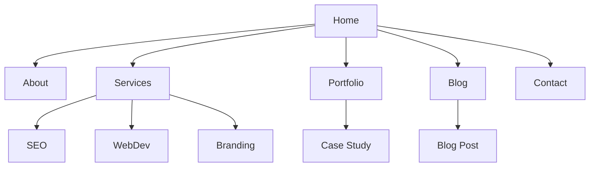

# BUILDER — Wireframe & Information Architecture

## Proposito
Mapear a estrutura ANTES do visual — wireframes, flows, sitemaps. Pensa antes de desenhar.

## Comandos
| Comando | Descricao |
|---------|-----------|
| `/builder-wireframe [pagina]` | Wireframe de uma pagina |
| `/builder-wireframe sitemap [app]` | Sitemap hierarquico |
| `/builder-wireframe flow [accao]` | User flow para uma accao |

## Wireframe Format (ASCII)

```
┌──────────────────────────────────────────┐
│  [Logo]           Nav    Nav    [CTA]    │
├──────────────────────────────────────────┤
│                                          │
│     [Badge: New Feature]                 │
│                                          │
│     ████████████████████                 │
│     Big Headline Here                    │
│     ████████████████████                 │
│                                          │
│     Subheadline text that explains       │
│     the value proposition clearly.       │
│                                          │
│     [Primary CTA]  [Secondary CTA]       │
│                                          │
│     "Trusted by 500+ companies"          │
│     [logo] [logo] [logo] [logo]          │
│                                          │
├──────────────────────────────────────────┤
│  Feature 1    Feature 2    Feature 3     │
│  [icon]       [icon]       [icon]        │
│  Title        Title        Title         │
│  Desc text    Desc text    Desc text     │
├──────────────────────────────────────────┤
```

## Sitemap (Mermaid)


## User Flow
```
[Landing] → [Click CTA] → [Pricing Page] → [Select Plan]
    → [Register Form] → [Email Verification] → [Dashboard]
```

## Output
1. ASCII wireframes per page
2. Sitemap (mermaid + text)
3. User flows (key journeys)
4. Content inventory (what text/images needed per page)

## Red Flags
- Wireframe sem hierarquia visual — tudo parece igual
- Sitemap sem profundidade maxima — user perde-se
- Flow sem error states — so o happy path
- Sem mobile wireframe — 60% do trafego
